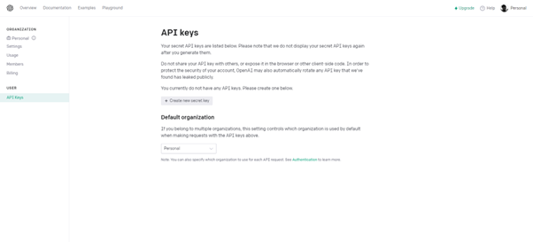

# Python-Voice-Assistant

A Python-based voice assistant that can greet you and perform a variety of tasks, including searching the web, opening social media, and creating a to-do list.

## How does this code work?

This voice assistant is built using a combination of various Python packages, making it easy for you to use and access a wide range of functionality.

## Installation

You need to download and install some modules in cmd with the help of pip to run it properly.

`pip install why`

`pip install customtkinter`

`pip install pyttsx3`

`pip install datetime`

`pip install speechrecognition`

`pip install wikipedia`

`pip install pyautogui`

`pip install screen_brightness_control`

`pip install pyscreenshot`

`pip install bs4`

`pip install requests`

`pip install pyjokes`

`pip install openai`

### Using Alternative method using Scripts

Alternatively, you can also use the provided scripts to make installation easy.
You can use Setup.bat in Windows and you can use Setup.sh file on Mac/Linux/UNIX-like Opearting Systems.

#### Running the Script

1) To run it you can open the directory and double-click on it.
2) To run it via the Terminal you can cd into the directory and type ./Setup.bat or ./Setup.sh and hit Enter.

## Using ChatGPT
To use ChatGPT, you would need an API key. To get the API Key follow the steps below.
### Getting API Keys
1) First go to https://openai.com/

2) Now click on API and Sign Up and make sure to state that the account is for Personal works.
3) Now go to Manage Accounts and go to Usage to make sure you have some free credits.

4) Now go to API Keys and generate an API key.

5) Copy and paste the API Key in the code.

## Contributing

If you have a suggestion that would make this better, please fork the repo and create a pull request. You can also open an issue with the tag `enhancement`.

1. Fork the Repository.
2. Create your Feature Branch. `git checkout -b feature/feature-name`
3. Commit your Changes. `git commit -s -m "Add some AmazingFeature"`
4. Push to the Branch. `git push origin feature/feature-name`
5. Open a Pull Request.

## Contributors

